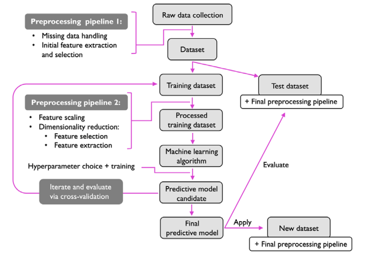

# Chapter 1 Notes

**Three types of machine learning**

- Supervised learning
  - Labeled data
  - Direct feedback
  - Predict outcome/future
- Unsupervised learning
  - No labels/targets
  - No feedback
  - Find hidden structure in data 
- Reinforcement learning
  - Decision process
  - Reward system
  - Learn series of actions

**Machine learning terminology**

- **Training example**: a row in a table representing the dataset and synonymous with an observation/record/instance/sample.
- **Taining**: Model fitting, for parametric models similar to parameter estimation
- **Feature, x**: A column in a data table/matrix. Synonymous with predictor, variable, input, attribute, or covariate.
- **Target, y**: Synonymous with outcome, output, response variable, dependent variable, (class) label, and ground truth
- **Loss function**: Synonymous with *cost* function. May also be called error function. In some literature, loss pertains to a single datapoint, while cost is for the whole dataset. 

**Roadmap**

**Preprocessing**

- **Feature scaling**: optimal performance when feature scaled. Simplest is range [0,1] or standard normal distribution with zero mean and unit variance.
- **Dimensionaly reduction**: For highly correlated features, this transformation results in lower storage space requirement and faster run of learning algorithm. 
- **Test/Train data**: Divide the dataset into test and train data randomly for better generalization. 

**Training and selecting a predictive model**

- It is essential to compare different learning algorithms in order to train and select the best performing model. 
- To do this, it is equaly important to decide on the metric to measure performance. 
- **Accuracy**: proportion of correctly classified instances
- **Cross-validation**: divide dataset into training and validation subsets to estimate the generalization performance of a model
- **Hyperparameter optimization**: Helps fine-tune the performance of a model. 

**Evaluating models and predicting unseen data instances**

